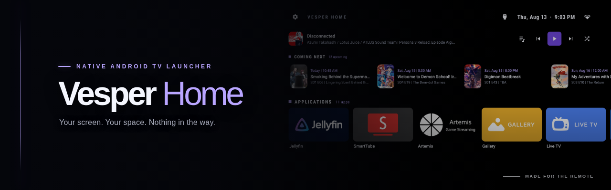

<p align="center">
  A fully native, ad-free Android TV launcher built for fast, predictable D-pad navigation.
</p>

> [!NOTE]
> Vesper Home is tailored to and tested on a Xiaomi TV A Pro (`MiTV-MOOR4`). The source is open, so anyone can compile it and adapt it to another Android TV setup.

## Features

<table>
  <tr>
    <td width="50%" valign="top">
      <strong>Apps, arranged your way</strong><br>
      Organize TV and sideloaded apps with favorites, categories, spacers, rows, grids, sorting, hiding, and custom banners.
    </td>
    <td width="50%" valign="top">
      <strong>Made for the remote</strong><br>
      Move through every row with explicit D-pad focus, reliable focus restoration, edge feedback, and optional key sounds.
    </td>
  </tr>
  <tr>
    <td width="50%" valign="top">
      <strong>Jellyfin from Home</strong><br>
      Discover and pair with Quick Connect, then play random tracks, playlists, and albums with artwork, queue browsing, and playback controls.
    </td>
    <td width="50%" valign="top">
      <strong>Coming Next</strong><br>
      See upcoming Sonarr episodes and Radarr releases on the home screen, with direct access to matching titles in Jellyfin.
    </td>
  </tr>
  <tr>
    <td colspan="2" valign="top">
      <strong>Search and add from the TV</strong><br>
      Search Sonarr and Radarr without leaving the launcher, choose monitoring and quality options, follow download progress under Added from TV, and open available titles directly in Jellyfin.
    </td>
  </tr>
  <tr>
    <td width="50%" valign="top">
      <strong>Your screen</strong><br>
      Choose light or dark themes, built-in or custom wallpapers, day and night scheduling, and focused-card animations.
    </td>
    <td width="50%" valign="top">
      <strong>TV essentials</strong><br>
      Keep inputs, network status, notifications, clock, and optional brightness scheduling close at hand.
    </td>
  </tr>
  <tr>
    <td width="50%" valign="top">
      <strong>Home and screensaver</strong><br>
      Set Vesper Home as the launcher, use the optional Home Button Fix, and run an OLED-friendly clock screensaver.
    </td>
    <td width="50%" valign="top">
      <strong>Portable and bilingual</strong><br>
      Create, restore, import, and share timestamped backups. Use the interface in English or Spanish.
    </td>
  </tr>
</table>

## Media Services

Open **Vesper Home > Settings > Integrations > Media services** to connect Jellyfin and configure Sonarr or Radarr. Once Sonarr or Radarr is connected, use the search button in the launcher status bar to find movies and series, select the root folder, quality profile, monitoring mode, tags, and download options, then add the title from the TV.

Titles added this way appear under **Added from TV**, where Vesper shows availability and download progress. Select a tracked title to open its matching movie or series directly in the connected Jellyfin TV app.

## Set as Home

Open **Vesper Home > Settings > Accessibility > Set as default launcher** and select Vesper Home in Android's Home app picker. If the device blocks changing the Home app, the optional **Home Button Fix** can redirect Home-button presses through an accessibility service.

> [!CAUTION]
> Do not disable the existing system launcher unless you know how to recover the device.

## Build

Install JDK 17 and the Android SDK, then use the repository Gradle wrapper:

```shell
./gradlew format
./gradlew lint
./gradlew check
./gradlew :app:assembleDebug
```

The APK is written to `app/build/outputs/apk/debug/app-debug.apk` with application ID `com.sergioasenjo.vesperhome.debug`.

## Credits

Vesper Home is derived from [LTvLauncher](https://github.com/leanbitlab-org/LtvLauncher) by [LeanBitLab](https://github.com/leanbitlab-org). LTvLauncher builds on [FLauncher](https://gitlab.com/flauncher/flauncher) by [etienn01](https://github.com/etienn01) and the [FLauncher fork](https://github.com/osrosal/flauncher) by [osrosal](https://github.com/osrosal).

## License

Vesper Home is distributed under the GNU General Public License v3.0. See [`LICENSE`](LICENSE).
